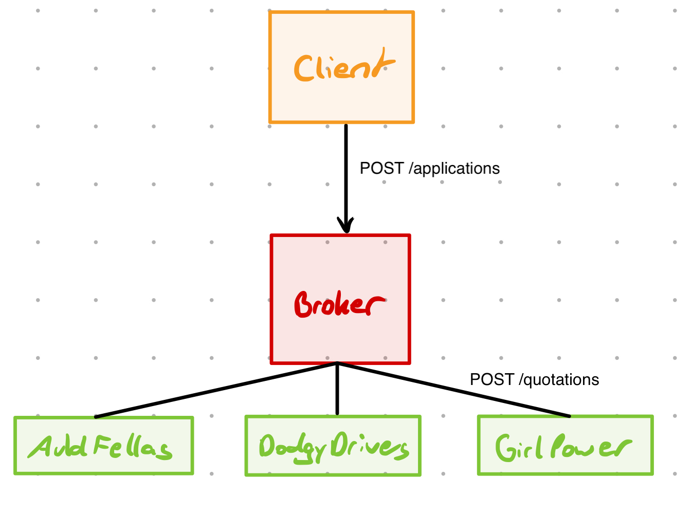

# QuoCo | Your friendly neighbourhood quote provider

This repository contains a [quote broker](./broker/) which will query [multiple](./auldfellas/) [quote](./dodgydrivers/) [providers](./girlpower/) discovered via mDNS
and returns a culminated overview of all the available quotes. There is also a [client](./client/) available which requests and displays said quotes in a tabular view.

## Architecture overview

There are three quoting services and a broker which queries them. The broker is in turn invoked by the client. The components communicate via an MQ message broker (in this case ActiveMQ). In this particular case, the messages follow a request-response pattern — the requests for the quoter services are using a pub-sub model (to collect all quotes) while the requests for the broker are using a reliable queue (to balance the load).



## Usage

There are multiple different ways in which you run the quoting service, detailed below ranking from simplest to hardest.

### Docker Compose

If you have a reasonably recent version of Docker installed, you can start all the modules including the client with a single command:

```bash
docker compose up --build
```

Running the above command will start all the required components and will launch the client after 30 seconds (to give everything a chance to properly connect).

### Docker

You can build and run the images manually using the following commands:

```bash
# Builds all images with a `quoco-jms-` prefix
./build-images.sh

# Create a network for the containers
docker network create quoco-jms

# Launch an ActiveMQ server
docker run --rm --name=activemq -it -p 8161:8161 -p 61616:61616 --platform linux/amd64 rmohr/activemq:latest

# Run these commands in separate terminals
docker run --rm -it --network quoco-jms -e MQ=failover://tcp://localhost:61616 -e ID=broker quoco-jms-broker
docker run --rm -it --network quoco-jms -e MQ=failover://tcp://localhost:61616 -e ID=auldfellas quoco-jms-auldfellas
docker run --rm -it --network quoco-jms -e MQ=failover://tcp://localhost:61616 -e ID=dodgydrivers quoco-jms-dodgydrivers
docker run --rm -it --network quoco-jms -e MQ=failover://tcp://localhost:61616 -e ID=girlpower quoco-jms-girlpower

docker run --rm -it --network quoco-jms -e MQ=failover://tcp://localhost:61616 -e ID=client quoco-jms-client
```

### Maven

You need to have an ActiveMQ server running locally for this to work (for running it in docker, see the section above). The commands required are as follows:

```bash
export MQ=failover://tcp://localhost:61616

# 1. Build all the code
mvn clean install package

# 2. Launch the broker
ID=broker mvn exec:java -pl broker

# 3. Connect the quoting services (in different terminals)
ID=auldfellas mvn exec:java -pl auldfellas
ID=dodgydrivers mvn exec:java -pl dodgydrivers
ID=girlpower mvn exec:java -pl girlpower

# 4. Run the client (in yet another terminal)
ID=client mvn exec:java -pl client
```

## Service degradation

The broker will return all quotes that arrived within a predetermined deadline, fixed to 1 second.